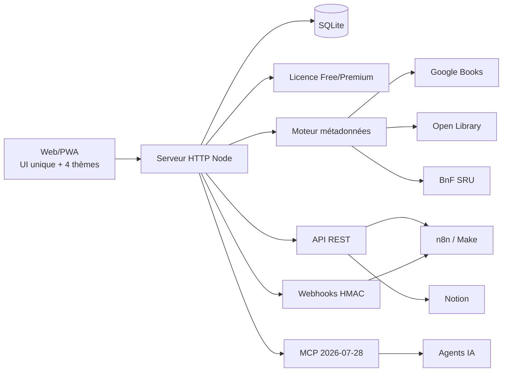

# Architecture

## Vue d'ensemble

## Choix v1

- **Frontend** : PWA sans framework ni dépendance runtime, afin de minimiser le poids et la surface d'attaque.
- **Backend** : Node HTTP natif.
- **Base** : `node:sqlite`, couche d'accès isolée dans `src/db.js` pour permettre une migration ultérieure vers PostgreSQL.
- **Recherche v1** : SQL indexé (`title`, `series`, `isbn`). Meilisearch reste une évolution possible si le catalogue global devient volumineux.
- **Métadonnées** : adaptateurs indépendants et tolérants aux pannes.
- **Licence** : jeton signé HMAC SHA-256, contrôlé côté serveur.
- **API** : clés aléatoires 192 bits, stockées uniquement sous forme de hash SHA-256.
- **MCP** : endpoint HTTP stateless protégé par clé API et licence Premium.

## Frontière de confiance

Les données d'usage (lecture, wishlist, prêt, commentaire, achat, dédicace) sont des données utilisateur. Le moteur d'enrichissement ne les remplace jamais. Les métadonnées externes ne remplissent que des champs vides dans la v1.
