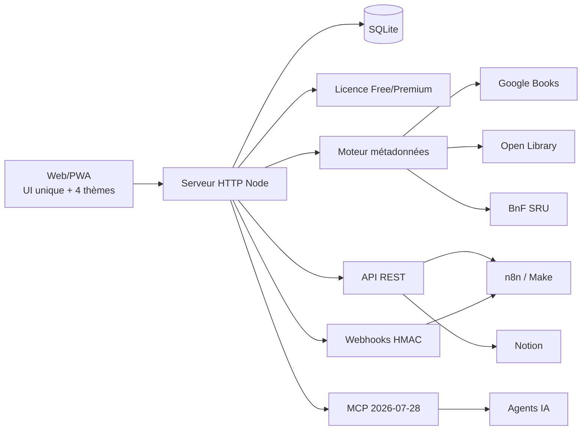

# Architecture

## Vue d'ensemble



## Choix v1

- **Frontend** : PWA sans framework ni dépendance runtime, afin de minimiser le poids et la surface d'attaque.
- **Backend** : Node HTTP natif.
- **Base** : `node:sqlite`, couche d'accès isolée dans `src/db.js` pour permettre une migration ultérieure vers PostgreSQL.
- **Recherche v1** : SQL indexé (`title`, `series`, `isbn`). Meilisearch reste une évolution possible si le catalogue global devient volumineux.
- **Métadonnées** : adaptateurs indépendants et tolérants aux pannes.
- **Licence** : jeton signé HMAC SHA-256, contrôlé côté serveur.
- **API** : clés aléatoires 192 bits, stockées uniquement sous forme de hash SHA-256.
- **MCP** : endpoint HTTP stateless protégé par clé API et licence Premium.

## Frontière de confiance

Les données d'usage (lecture, wishlist, prêt, commentaire, achat, dédicace) sont des données utilisateur. Le moteur d'enrichissement ne les remplace jamais. Les métadonnées externes ne remplissent que des champs vides dans la v1.

## QA et traçabilité

La QA fait partie de l'architecture de livraison et n'est pas traitée comme une étape documentaire séparée.

```mermaid
flowchart LR
  CODE[Changement code / doc] --> CI[CI Node 22 + 24]
  CI --> TESTS[Tests + couverture]
  TESTS --> PREVIEW[Déploiement preview alwaysdata]
  PREVIEW --> HEALTH[/api/health]
  HEALTH --> LIVE[Contrôles live ciblés]
  LIVE --> QA[docs/QA-TRACKING.md]
  QA --> TRACE[PR ou commit main]
```

Principes :

- `docs/QA-TRACKING.md` est le **journal QA courant** et doit être mis à jour au fur et à mesure ;
- chaque validation significative conserve une preuve : run CI, déploiement, test manuel ou rapport dédié ;
- la colonne **PR** référence la Pull Request associée ; si une modification est poussée directement sur `main`, le commit sert de trace de remplacement ;
- `docs/QA-REPORT.md` reste un rapport figé de la validation v1.0.0 et ne remplace pas le journal vivant ;
- un test partiel, ignoré ou dépendant d'un matériel réel reste explicitement marqué comme tel ;
- une fonctionnalité n'est considérée comme validée que lorsque son état est reporté dans le suivi QA.

La preview alwaysdata constitue l'environnement de validation mobile/iPad. Le workflow de déploiement synchronise les fichiers puis exécute le health check et les contrôles live. Le redémarrage automatique par API est un confort d'exploitation : son absence ne doit pas masquer le résultat réel des contrôles de disponibilité.
