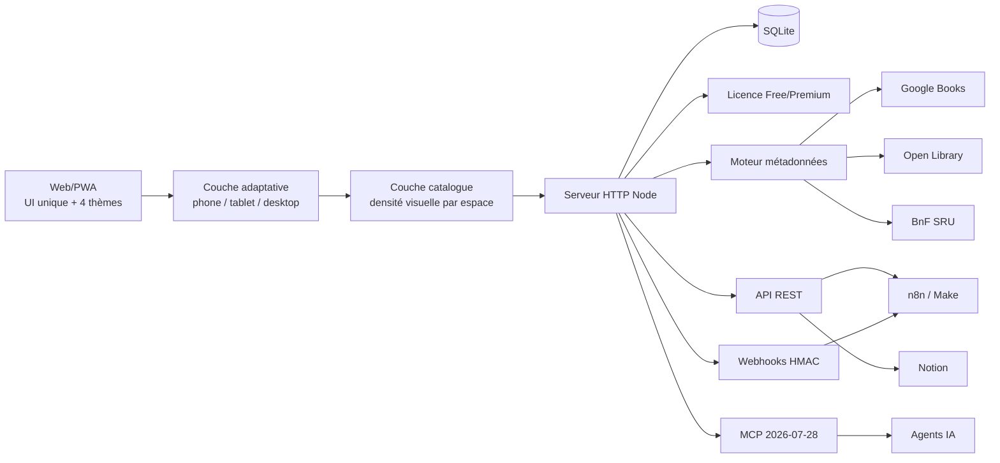

# Architecture

## Vue d'ensemble



## Choix v1

- **Frontend** : PWA sans framework ni dépendance runtime, afin de minimiser le poids et la surface d'attaque.
- **Backend** : Node HTTP natif.
- **Base** : `node:sqlite`, couche d'accès isolée dans `src/db.js` pour permettre une migration ultérieure vers PostgreSQL.
- **Recherche v1** : SQL indexé (`title`, `series`, `isbn`). Meilisearch reste une évolution possible si le catalogue global devient volumineux.
- **Métadonnées** : adaptateurs indépendants et tolérants aux pannes.
- **Licence** : jeton signé HMAC SHA-256, contrôlé côté serveur.
- **API** : clés aléatoires 192 bits, stockées uniquement sous forme de hash SHA-256.
- **MCP** : endpoint HTTP stateless protégé par clé API et licence Premium.

## Interface adaptative universelle

BD Desk ne maintient pas une application desktop et une seconde application mobile. Les écrans, routes, données, règles métier et composants restent communs ; seule **la composition visuelle** s'adapte au terminal.

La détection est centralisée dans `public/adaptive-ui.js`. Elle n'utilise pas de sniffing `user-agent` et ne dépend donc ni d'Apple, ni d'Android, ni d'un navigateur particulier. Elle croise :

- la largeur réellement disponible dans le viewport ;
- le petit côté physique déclaré par l'écran ;
- la présence d'un pointeur tactile / `maxTouchPoints` ;
- l'orientation portrait ou paysage.

Le résultat est exposé via `data-device="phone|tablet|desktop"` et `data-orientation="portrait|landscape"` sur le document. `public/adaptive-ui.css` applique ensuite les compositions appropriées.

### Smartphone

En portrait, BD Desk applique une interface dédiée :

- header compact avec marque BD Desk, menu et recherche ouverte à la demande ;
- navigation principale fixée en bas, avec action Ajouter centrale ;
- collection en **2 colonnes** au lieu de réduire artificiellement la grille desktop ;
- actions secondaires de page regroupées dans un menu compact ;
- boutons et champs dimensionnés pour le tactile ;
- safe areas iOS/Android intégrées aux espacements ;
- tiroirs et modales sur toute la largeur utile.

En paysage, le terminal reste en mode smartphone mais utilise davantage d'espace horizontal : grille plus dense, recherche complète et navigation basse plus compacte.

### Tablette et desktop

La tablette conserve la même application et bénéficie des règles responsive existantes selon la place disponible. Le desktop conserve sidebar, recherche permanente et densité maximale. Les quatre thèmes ne modifient jamais cette logique fonctionnelle.

Cette séparation `fonctionnel commun` / `composition adaptative` permet d'ajouter d'autres formats d'écran sans dupliquer les routes, le backend ou les workflows métier.

## Couche catalogue visuelle

`public/catalog-ui.css` est une couche indépendante placée après le design system et la couche adaptative. Elle transforme la présentation de l'accueil et de la collection en **bibliothèque visuelle dense**, sans modifier les routes ni les données.

Le principe est volontairement inspiré des forces fonctionnelles des catalogues BD historiques : beaucoup de couvertures visibles, accès rapide aux filtres et hiérarchie simple. L'identité graphique, les composants et la navigation restent propres à BD Desk.

Matrice cible :

| Mode | Densité |
|---|---|
| Smartphone portrait | 2 colonnes compactes, objectif 2 × 2 visible dans un écran PWA courant |
| Smartphone paysage | 4 colonnes |
| Tablette portrait | 4 colonnes |
| Tablette paysage | 5 colonnes |
| Desktop | généralement 6 à 8 colonnes selon largeur |

Les cartes conservent la couverture comme élément principal et réduisent les métadonnées secondaires. Sur smartphone portrait, la troisième ligne descriptive est masquée pour limiter la hauteur. La barre de filtre de collection est sticky et compacte.

Cette couche est développée sur `feat/catalog-ui-refresh`. `main` reste le **point de retour validé** tant que la nouvelle densité n'a pas passé CI puis la QA visuelle iPhone/iPad.

Voir [`UI-CATALOG.md`](UI-CATALOG.md) pour le contrat visuel détaillé.

## Frontière de confiance

Les données d'usage (lecture, wishlist, prêt, commentaire, achat, dédicace) sont des données utilisateur. Le moteur d'enrichissement ne les remplace jamais. Les métadonnées externes ne remplissent que des champs vides dans la v1.

## QA et traçabilité

La QA fait partie de l'architecture de livraison et n'est pas traitée comme une étape documentaire séparée.

```mermaid
flowchart LR
  CODE[Changement code / doc] --> BRANCH[Branche dédiée]
  BRANCH --> CI[CI Node 22 + 24]
  CI --> TESTS[Tests + couverture + syntaxe frontend]
  TESTS --> PR[Pull Request]
  PR --> QA[QA visuelle / matérielle]
  QA --> MERGE[Fusion main]
  MERGE --> PREVIEW[Déploiement preview alwaysdata]
  PREVIEW --> HEALTH[/api/health]
  HEALTH --> LIVE[Contrôles live ciblés]
  LIVE --> TRACK[docs/QA-TRACKING.md]
```

Principes :

- `docs/QA-TRACKING.md` est le **journal QA courant** et doit être mis à jour au fur et à mesure ;
- chaque validation significative conserve une preuve : run CI, déploiement, test manuel ou rapport dédié ;
- la colonne **PR** référence la Pull Request associée ; si une modification est poussée directement sur `main`, le commit sert de trace de remplacement ;
- les refontes UI significatives sont désormais isolées dans une branche et une PR avant fusion ;
- `docs/QA-REPORT.md` reste un rapport figé de la validation v1.0.0 et ne remplace pas le journal vivant ;
- un test partiel, ignoré ou dépendant d'un matériel réel reste explicitement marqué comme tel ;
- une fonctionnalité n'est considérée comme validée que lorsque son état est reporté dans le suivi QA.

### Matrice iOS réelle

La validation mobile de release couvre **deux matériels distincts** :

- **iPad** : navigateur réel portrait/paysage puis PWA installée ;
- **iPhone** : navigateur réel portrait/paysage puis PWA installée.

La campagne `QA-IOS-001` à `QA-IOS-020` couvre le chargement, la navigation tactile, les quatre thèmes, la fiche album, la recherche, l'ajout, le scanner ISBN/EAN avec caméra réelle, les interactions de collection et la reprise de la PWA. Les tests sont exécutés **strictement un par un** ; une anomalie est corrigée et retestée avant de passer au test suivant.

Le contrat d'interface adaptative et de densité catalogue est également contrôlé automatiquement : présence des assets, détection sans `user-agent`, grille smartphone portrait compacte, matrices tablette/desktop, navigation mobile et mise en cache PWA.

La preview alwaysdata constitue l'environnement de validation iOS après fusion sur `main`. Le workflow de déploiement synchronise les fichiers puis exécute le health check et les contrôles live. Le redémarrage automatique par API est un confort d'exploitation : son absence ne doit pas masquer le résultat réel des contrôles de disponibilité.